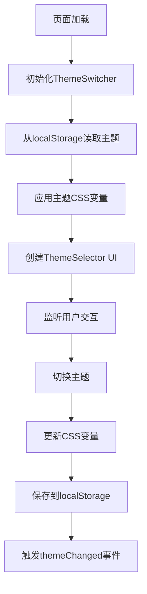

# QQ聊天记录分析系统 - 主题设计文档

## 📋 目录

1. [系统概述](#系统概述)
2. [主题架构](#主题架构)
3. [CSS变量系统](#css变量系统)
4. [主题配置](#主题配置)
5. [API文档](#api文档)
6. [设计指南](#设计指南)
7. [最佳实践](#最佳实践)
8. [示例主题](#示例主题)
9. [故障排除](#故障排除)

---

## 🎨 系统概述

本系统采用基于CSS变量的动态主题切换架构，支持多套皮肤的无缝切换，保持所有现有功能和动画效果。

### 核心特性

- **动态主题切换** - 实时切换主题，无需刷新页面
- **CSS变量驱动** - 基于CSS自定义属性的响应式设计
- **多页面同步** - 跨标签页主题状态同步
- **本地存储** - 自动保存用户主题偏好
- **扩展性强** - 易于添加新主题和自定义样式

### 文件结构

```
static/
├── theme-switcher.js      # 主题切换核心逻辑
├── theme-selector.js      # 主题选择器UI组件
├── style.css             # 主样式文件（包含CSS变量定义）
├── index.html            # 主页（包含预加载主题脚本）
├── announcements.html    # 群公告页面
├── individual.html       # 个人分析页面
├── relation.html         # 关系图页面
└── easter-egg.html       #彩蛋页面
```

---

## 🏗️ 主题架构

### 核心组件

#### 1. ThemeSwitcher 类
- **位置**: `theme-switcher.js`
- **功能**: 主题管理核心，负责主题定义、切换、存储
- **实例**: `window.themeSwitcher`

#### 2. ThemeSelector 类
- **位置**: `theme-selector.js`
- **功能**: 主题选择器UI，提供用户交互界面
- **实例**: 自动初始化

#### 3. CSS变量系统
- **位置**: `style.css` + 各HTML文件的预加载脚本
- **功能**: 定义主题样式变量，支持动态切换

### 工作流程



---

## 🎯 CSS变量系统

### 变量分类

#### 1. 主题色调 (Theme Colors)
```css
/* 主色调 */
--color-primary: #667eea;           /* 主要颜色 */
--color-primary-dark: #764ba2;      /* 主要颜色深色版 */
--color-secondary: #f093fb;         /* 次要颜色 */
--color-secondary-dark: #f5576c;    /* 次要颜色深色版 */
--color-accent: #4facfe;            /* 强调色 */
--color-accent-dark: #00f2fe;       /* 强调色深色版 */
```

#### 2. 背景系统 (Background System)
```css
/* 复合渐变背景 */
--theme-bg-gradient: radial-gradient(...);     /* 主背景渐变 */
--theme-bg-overlay: radial-gradient(...);      /* 背景叠加层 */
--theme-bg-secondary: linear-gradient(...);    /* 次要背景 */

/* 卡片背景 */
--theme-card-bg: rgba(255, 255, 255, 0.70);          /* 卡片背景 */
--theme-card-bg-hover: rgba(255, 255, 255, 0.85);    /* 卡片悬停背景 */
```

#### 3. 交互元素 (Interactive Elements)
```css
/* 按钮渐变 */
--theme-btn-gradient: linear-gradient(...);        /* 按钮渐变 */
--theme-btn-gradient-hover: linear-gradient(...);   /* 按钮悬停渐变 */

/* 边框渐变 */
--theme-border-gradient: linear-gradient(...);      /* 彩虹边框渐变 */

/* 标签样式 */
--theme-tag-bg: rgba(102, 126, 234, 0.1);         /* 标签背景 */
--theme-tag-bg-hover: rgba(200, 255, 240, 0.9);   /* 标签悬停背景 */
--theme-tag-gradient-1: linear-gradient(...);      /* 标签渐变1 */
--theme-tag-gradient-2: linear-gradient(...);      /* 标签渐变2 */
--theme-tag-gradient-3: linear-gradient(...);      /* 标签渐变3 */
```

#### 4. 文字颜色 (Text Colors)
```css
/* 基础文字颜色 */
--color-text-primary: #1a202c;      /* 主要文字 */
--color-text-secondary: #2d3748;    /* 次要文字 */
--color-text-muted: #4a5568;        /* 弱化文字 */
--color-text-light: #a0aec0;        /* 浅色文字 */
--color-text-white: #ffffff;        /* 白色文字 */
--color-text-black: #000000;        /* 黑色文字 */
--color-text-dark: #444444;         /* 深色文字 */

/* 语义化文字颜色 */
--color-text-info: #5a67d8;         /* 信息文字 */
--color-text-success: #2e7d32;      /* 成功文字 */
--color-text-error: #c62828;        /* 错误文字 */
--color-text-warning: #c53030;      /* 警告文字 */
--color-text-link: #1565c0;         /* 链接文字 */
```

#### 5. 背景颜色 (Background Colors)
```css
--color-bg-white: #ffffff;                    /* 白色背景 */
--color-bg-light: rgba(255, 255, 255, 0.9);  /* 浅色背景 */
--color-bg-success: rgba(76, 175, 80, 0.1);  /* 成功背景 */
--color-bg-error: rgba(244, 67, 54, 0.1);    /* 错误背景 */
--color-bg-info: rgba(102, 126, 234, 0.12);  /* 信息背景 */
```

#### 6. 边框颜色 (Border Colors)
```css
--color-border-success: rgba(76, 175, 80, 0.3);   /* 成功边框 */
--color-border-error: rgba(244, 67, 54, 0.3);     /* 错误边框 */
--color-border-info: rgba(102, 126, 234, 0.25);   /* 信息边框 */
```

#### 7. 页面专用变量 (Page-Specific Variables)

##### 群公告页面
```css
--announcement-bg-dark: rgba(50, 50, 50, 0.8);      /* 暗黑模式公告背景 */
--announcement-border-dark: rgba(90, 111, 216, 0.3); /* 暗黑模式公告边框 */
--announcement-title-color-dark: #f0f0f0;            /* 暗黑模式标题颜色 */
--announcement-content-color-dark: #e0e0e0;          /* 暗黑模式内容颜色 */
```

##### 关系图页面
```css
--relation-header-bg: rgba(255, 255, 255, 0.85);     /* 关系图头部背景 */
--relation-header-border: rgba(255, 255, 255, 0.6);  /* 关系图头部边框 */
--relation-graph-bg: rgba(255, 255, 255, 0.9);       /* 关系图背景 */
--relation-note-bg: rgba(255, 255, 255, 0.95);       /* 关系图注释背景 */
--relation-note-border: rgba(255, 255, 255, 0.85);   /* 关系图注释边框 */
--relation-legend-text-color: #4a5568;               /* 图例文字颜色 */
--relation-preview-label-color: #2d3748;             /* 预览标签颜色 */
```

---

## ⚙️ 主题配置

### 主题定义结构

```javascript
{
    themeName: {
        name: '主题显示名称',
        description: '主题描述',
        variables: {
            '--css-variable-name': 'css-value',
            // ... 更多变量
        }
    }
}
```

### 内置主题

#### 1. 浅色主题 (default)
- **风格**: 经典玻璃拟态风格
- **特点**: 明亮、现代、渐变丰富
- **适用**: 日间使用，视觉效果佳

#### 2. 暗黑主题 (dark)
- **风格**: 深色护眼模式
- **特点**: 低对比度、护眼、专业感
- **适用**: 夜间使用，长时间阅读

### 主题变量映射

| 变量类别 | 浅色主题 | 暗黑主题 | 说明 |
|---------|---------|---------|------|
| 主色调 | 蓝紫渐变 | 深灰蓝调 | 整体色彩基调 |
| 卡片背景 | 白色半透明 | 深灰半透明 | 内容区域背景 |
| 文字颜色 | 深色系 | 浅色系 | 确保对比度 |
| 按钮样式 | 彩色渐变 | 深色渐变 | 交互元素样式 |

---

## 📚 API文档

### ThemeSwitcher 类

#### 构造函数
```javascript
new ThemeSwitcher()
```
自动初始化主题系统，加载保存的主题设置。

#### 方法

##### `switchTheme(themeName)`
切换到指定主题
- **参数**: `themeName` (string) - 主题名称
- **返回**: 无
- **示例**: 
```javascript
window.themeSwitcher.switchTheme('dark');
```

##### `getCurrentTheme()`
获取当前主题名称
- **参数**: 无
- **返回**: string - 当前主题名称
- **示例**:
```javascript
const currentTheme = window.themeSwitcher.getCurrentTheme();
console.log(currentTheme); // 'default' 或 'dark'
```

##### `getAvailableThemes()`
获取所有可用主题列表
- **参数**: 无
- **返回**: Array - 主题信息数组
- **示例**:
```javascript
const themes = window.themeSwitcher.getAvailableThemes();
// [
//   { key: 'default', name: '浅色主题', description: '经典玻璃拟态风格' },
//   { key: 'dark', name: '暗黑主题', description: '深色护眼模式' }
// ]
```

##### `addTheme(key, themeConfig)`
添加新主题
- **参数**: 
  - `key` (string) - 主题唯一标识
  - `themeConfig` (object) - 主题配置对象
- **返回**: 无
- **示例**:
```javascript
window.themeSwitcher.addTheme('custom', {
    name: '自定义主题',
    description: '我的个性化主题',
    variables: {
        '--color-primary': '#ff6b6b',
        '--color-secondary': '#4ecdc4',
        // ... 更多变量
    }
});
```

##### `removeTheme(key)`
移除主题
- **参数**: `key` (string) - 主题标识
- **返回**: boolean - 是否成功移除
- **注意**: 不能移除浅色主题
- **示例**:
```javascript
const success = window.themeSwitcher.removeTheme('custom');
```

#### 事件

##### `themeChanged`
主题切换时触发的自定义事件
- **事件对象**: 
```javascript
{
    detail: {
        themeName: 'dark',        // 新主题名称
        theme: { /* 主题配置 */ }, // 主题配置对象
        switcher: ThemeSwitcher   // 主题切换器实例
    }
}
```
- **监听示例**:
```javascript
document.addEventListener('themeChanged', (event) => {
    console.log('主题已切换到:', event.detail.themeName);
    // 执行主题切换后的自定义逻辑
});
```

### ThemeSelector 类

#### 构造函数
```javascript
new ThemeSelector()
```
自动创建主题选择器UI并绑定事件。

#### 方法

##### `togglePanel()`
切换主题选择面板的显示/隐藏状态

##### `openPanel()`
显示主题选择面板

##### `closePanel()`
隐藏主题选择面板

---

## 🎨 设计指南

### 颜色设计原则

#### 1. 对比度要求
- **文字对比度**: 确保文字与背景的对比度至少为4.5:1
- **交互元素**: 按钮、链接等交互元素需要足够的视觉反馈
- **状态区分**: 不同状态（正常、悬停、激活）需要明显区分

#### 2. 色彩和谐
- **主色调**: 选择2-3个主要颜色作为主题基调
- **渐变设计**: 使用渐变时保持色彩的和谐过渡
- **语义化**: 成功、警告、错误等状态使用约定俗成的颜色

#### 3. 暗黑模式适配
- **降低亮度**: 暗黑模式下所有颜色亮度应适当降低
- **保持层次**: 确保在深色背景下仍能区分不同层级
- **护眼考虑**: 避免过于刺眼的高对比度

### 布局设计原则

#### 1. 玻璃拟态效果
- **透明度**: 使用半透明背景营造层次感
- **模糊效果**: 适当使用backdrop-filter创建毛玻璃效果
- **边框**: 使用细微的边框增强玻璃质感

#### 2. 响应式设计
- **弹性布局**: 使用flexbox和grid布局
- **相对单位**: 优先使用rem、em、%等相对单位
- **断点设计**: 考虑不同屏幕尺寸的适配

### 动画设计原则

#### 1. 过渡效果
- **平滑切换**: 主题切换时使用CSS transition
- **合理时长**: 过渡动画时长控制在0.2-0.5秒
- **缓动函数**: 使用ease-in-out等自然的缓动效果

#### 2. 交互反馈
- **悬停效果**: 鼠标悬停时提供视觉反馈
- **点击反馈**: 点击时提供即时的视觉响应
- **加载状态**: 为异步操作提供加载动画

---

## 💡 最佳实践

### 1. 主题开发流程

#### 步骤1: 规划设计
```markdown
1. 确定主题风格和目标用户
2. 选择主色调和配色方案
3. 设计关键界面的视觉效果
4. 考虑暗黑模式的适配方案
```

#### 步骤2: 变量定义
```javascript
// 1. 定义基础色彩变量
const baseColors = {
    '--color-primary': '#your-primary-color',
    '--color-secondary': '#your-secondary-color',
    // ...
};

// 2. 基于基础色彩生成衍生变量
const derivedColors = {
    '--theme-card-bg': `rgba(${hexToRgb(baseColors['--color-primary'])}, 0.1)`,
    // ...
};
```

#### 步骤3: 测试验证
```markdown
1. 在不同页面测试主题效果
2. 验证文字对比度是否符合要求
3. 测试主题切换的流畅性
4. 检查响应式布局的兼容性
```

### 2. 性能优化

#### CSS变量优化
```css
/* ✅ 推荐：使用CSS变量 */
.card {
    background: var(--theme-card-bg);
    color: var(--color-text-primary);
}

/* ❌ 避免：硬编码颜色值 */
.card {
    background: rgba(255, 255, 255, 0.8);
    color: #1a202c;
}
```

#### 减少重绘
```css
/* ✅ 推荐：使用transform和opacity */
.theme-transition {
    transition: transform 0.3s ease, opacity 0.3s ease;
}

/* ❌ 避免：频繁改变layout属性 */
.theme-transition {
    transition: width 0.3s ease, height 0.3s ease;
}
```

### 3. 兼容性考虑

#### 浏览器支持
```javascript
// 检查CSS变量支持
if (window.CSS && CSS.supports('color', 'var(--fake-var)')) {
    // 支持CSS变量，使用主题系统
    initThemeSystem();
} else {
    // 不支持CSS变量，使用降级方案
    useFallbackTheme();
}
```

#### 降级方案
```css
/* 为不支持CSS变量的浏览器提供降级 */
.card {
    background: rgba(255, 255, 255, 0.8); /* 降级值 */
    background: var(--theme-card-bg);      /* CSS变量 */
}
```

### 4. 维护性

#### 变量命名规范
```css
/* ✅ 推荐：语义化命名 */
--color-text-primary
--theme-card-bg
--color-border-success

/* ❌ 避免：颜色值命名 */
--color-blue
--bg-white-80
--border-green
```

#### 文档维护
```markdown
1. 及时更新变量文档
2. 记录主题设计的决策原因
3. 提供使用示例和最佳实践
4. 维护变更日志
```

---

## 🌟 示例主题

### 创建自定义主题

#### 示例：春天主题
```javascript
// 1. 定义主题配置
const springTheme = {
    name: '春天主题',
    description: '清新自然的春日风格',
    variables: {
        // 主色调 - 春天的绿色系
        '--color-primary': '#52c41a',
        '--color-primary-dark': '#389e0d',
        '--color-secondary': '#73d13d',
        '--color-secondary-dark': '#52c41a',
        '--color-accent': '#95de64',
        '--color-accent-dark': '#73d13d',
        
        // 背景系统 - 清新渐变
        '--theme-bg-gradient': 'linear-gradient(135deg, #f6ffed 0%, #d9f7be 50%, #b7eb8f 100%)',
        '--theme-bg-overlay': 'radial-gradient(circle at 30% 70%, rgba(82, 196, 26, 0.1) 2px, transparent 2px)',
        '--theme-bg-secondary': 'linear-gradient(135deg, #f6ffed 0%, #d9f7be 100%)',
        
        // 卡片背景 - 自然透明
        '--theme-card-bg': 'rgba(246, 255, 237, 0.8)',
        '--theme-card-bg-hover': 'rgba(246, 255, 237, 0.95)',
        
        // 按钮渐变 - 生机勃勃
        '--theme-btn-gradient': 'linear-gradient(135deg, #52c41a 0%, #73d13d 100%)',
        '--theme-btn-gradient-hover': 'linear-gradient(135deg, #73d13d 0%, #95de64 100%)',
        
        // 文字颜色 - 自然深绿
        '--color-text-primary': '#135200',
        '--color-text-secondary': '#389e0d',
        '--color-text-muted': '#52c41a',
        
        // 标签渐变 - 春日系列
        '--theme-tag-gradient-1': 'linear-gradient(135deg, rgba(82, 196, 26, 0.1), rgba(56, 158, 13, 0.1))',
        '--theme-tag-gradient-2': 'linear-gradient(135deg, rgba(115, 209, 61, 0.1), rgba(149, 222, 100, 0.1))',
        '--theme-tag-gradient-3': 'linear-gradient(135deg, rgba(183, 235, 143, 0.1), rgba(217, 247, 190, 0.1))',
    }
};

// 2. 添加主题到系统
window.themeSwitcher.addTheme('spring', springTheme);

// 3. 切换到新主题
window.themeSwitcher.switchTheme('spring');
```

#### 示例：科技主题
```javascript
const techTheme = {
    name: '科技主题',
    description: '未来感十足的科技风格',
    variables: {
        // 主色调 - 科技蓝
        '--color-primary': '#1890ff',
        '--color-primary-dark': '#096dd9',
        '--color-secondary': '#722ed1',
        '--color-secondary-dark': '#531dab',
        '--color-accent': '#13c2c2',
        '--color-accent-dark': '#08979c',
        
        // 背景系统 - 科技渐变
        '--theme-bg-gradient': 'linear-gradient(135deg, #001529 0%, #002766 50%, #003a8c 100%)',
        '--theme-bg-overlay': 'repeating-linear-gradient(90deg, transparent, transparent 2px, rgba(24, 144, 255, 0.03) 2px, rgba(24, 144, 255, 0.03) 4px)',
        
        // 卡片背景 - 科技感透明
        '--theme-card-bg': 'rgba(0, 21, 41, 0.8)',
        '--theme-card-bg-hover': 'rgba(0, 39, 102, 0.9)',
        
        // 按钮渐变 - 霓虹效果
        '--theme-btn-gradient': 'linear-gradient(135deg, #1890ff 0%, #722ed1 100%)',
        '--theme-btn-gradient-hover': 'linear-gradient(135deg, #40a9ff 0%, #9254de 100%)',
        
        // 文字颜色 - 科技亮色
        '--color-text-primary': '#ffffff',
        '--color-text-secondary': '#91d5ff',
        '--color-text-muted': '#69c0ff',
        
        // 边框渐变 - 霓虹边框
        '--theme-border-gradient': 'linear-gradient(45deg, #1890ff, #722ed1, #13c2c2, #52c41a)',
    }
};

window.themeSwitcher.addTheme('tech', techTheme);
```

### 主题预设模板

#### 1. 最小主题模板
```javascript
const minimalTheme = {
    name: '主题名称',
    description: '主题描述',
    variables: {
        // 必需的基础变量
        '--color-primary': '#color',
        '--color-text-primary': '#color',
        '--theme-card-bg': 'rgba(...)',
        '--theme-btn-gradient': 'linear-gradient(...)',
        
        // 可选的扩展变量
        // ...
    }
};
```

#### 2. 完整主题模板
```javascript
const completeTheme = {
    name: '完整主题',
    description: '包含所有变量的完整主题模板',
    variables: {
        // 1. 主色调
        '--color-primary': '#color',
        '--color-primary-dark': '#color',
        '--color-secondary': '#color',
        '--color-secondary-dark': '#color',
        '--color-accent': '#color',
        '--color-accent-dark': '#color',
        
        // 2. 背景系统
        '--theme-bg-gradient': 'gradient',
        '--theme-bg-overlay': 'gradient',
        '--theme-bg-secondary': 'gradient',
        '--theme-card-bg': 'rgba(...)',
        '--theme-card-bg-hover': 'rgba(...)',
        
        // 3. 交互元素
        '--theme-btn-gradient': 'gradient',
        '--theme-btn-gradient-hover': 'gradient',
        '--theme-border-gradient': 'gradient',
        '--theme-tag-bg': 'rgba(...)',
        '--theme-tag-bg-hover': 'rgba(...)',
        
        // 4. 文字颜色
        '--color-text-primary': '#color',
        '--color-text-secondary': '#color',
        '--color-text-muted': '#color',
        '--color-text-light': '#color',
        '--color-text-white': '#color',
        '--color-text-black': '#color',
        '--color-text-dark': '#color',
        '--color-text-info': '#color',
        '--color-text-success': '#color',
        '--color-text-error': '#color',
        '--color-text-warning': '#color',
        '--color-text-link': '#color',
        
        // 5. 背景颜色
        '--color-bg-white': '#color',
        '--color-bg-light': 'rgba(...)',
        '--color-bg-success': 'rgba(...)',
        '--color-bg-error': 'rgba(...)',
        '--color-bg-info': 'rgba(...)',
        
        // 6. 边框颜色
        '--color-border-success': 'rgba(...)',
        '--color-border-error': 'rgba(...)',
        '--color-border-info': 'rgba(...)',
        
        // 7. 标签渐变
        '--theme-tag-gradient-1': 'gradient',
        '--theme-tag-gradient-2': 'gradient',
        '--theme-tag-gradient-3': 'gradient',
        
        // 8. 页面专用变量（可选）
        '--announcement-bg-dark': 'rgba(...)',
        '--announcement-border-dark': 'rgba(...)',
        '--announcement-title-color-dark': '#color',
        '--announcement-content-color-dark': '#color',
        
        '--relation-header-bg': 'rgba(...)',
        '--relation-header-border': 'rgba(...)',
        '--relation-graph-bg': 'rgba(...)',
        '--relation-note-bg': 'rgba(...)',
        '--relation-note-border': 'rgba(...)',
        '--relation-legend-text-color': '#color',
        '--relation-preview-label-color': '#color',
    }
};
```

---

## 🔧 故障排除

### 常见问题

#### 1. 主题切换不生效
**症状**: 点击主题切换按钮后页面样式没有变化

**可能原因**:
- CSS变量名称不匹配
- 浏览器不支持CSS变量
- JavaScript错误阻止了主题应用

**解决方案**:
```javascript
// 1. 检查浏览器支持
console.log('CSS变量支持:', window.CSS && CSS.supports('color', 'var(--test)'));

// 2. 检查主题是否正确加载
console.log('当前主题:', window.themeSwitcher.getCurrentTheme());
console.log('可用主题:', window.themeSwitcher.getAvailableThemes());

// 3. 手动应用主题
window.themeSwitcher.switchTheme('dark');
```

#### 2. 部分元素样式异常
**症状**: 主题切换后某些元素的样式显示不正确

**可能原因**:
- 缺少对应的CSS变量定义
- CSS优先级问题
- 硬编码的样式覆盖了主题变量

**解决方案**:
```css
/* 1. 检查是否使用了CSS变量 */
.element {
    /* ❌ 硬编码 */
    color: #1a202c;
    
    /* ✅ 使用变量 */
    color: var(--color-text-primary);
}

/* 2. 提供降级值 */
.element {
    color: #1a202c; /* 降级值 */
    color: var(--color-text-primary, #1a202c); /* 带默认值的变量 */
}

/* 3. 检查CSS优先级 */
.element {
    color: var(--color-text-primary) !important;
}
```

#### 3. 主题选择器UI问题
**症状**: 主题选择器按钮不显示或点击无响应

**可能原因**:
- ThemeSelector类未正确初始化
- CSS样式冲突
- 事件绑定失败

**解决方案**:
```javascript
// 1. 检查ThemeSelector是否初始化
console.log('ThemeSelector:', window.themeSelector);

// 2. 手动重新初始化
document.addEventListener('DOMContentLoaded', () => {
    if (!window.themeSelector) {
        window.themeSelector = new ThemeSelector();
    }
});

// 3. 检查按钮是否存在
const button = document.getElementById('theme-selector-btn');
console.log('主题按钮:', button);
```

#### 4. 跨页面主题同步问题
**症状**: 在一个页面切换主题后，其他页面的主题没有同步更新

**可能原因**:
- localStorage事件监听器未正确设置
- 页面间的主题初始化时机不同

**解决方案**:
```javascript
// 1. 检查localStorage监听器
window.addEventListener('storage', (e) => {
    console.log('Storage事件:', e.key, e.newValue);
    if (e.key === 'selectedTheme') {
        window.themeSwitcher.switchTheme(e.newValue);
    }
});

// 2. 手动同步主题
const savedTheme = localStorage.getItem('selectedTheme');
if (savedTheme) {
    window.themeSwitcher.switchTheme(savedTheme);
}
```

### 调试工具

#### 1. 主题调试控制台
```javascript
// 在浏览器控制台中使用的调试工具
window.themeDebug = {
    // 查看当前所有CSS变量
    getCurrentVariables() {
        const root = document.documentElement;
        const styles = getComputedStyle(root);
        const variables = {};
        
        for (let i = 0; i < styles.length; i++) {
            const name = styles[i];
            if (name.startsWith('--')) {
                variables[name] = styles.getPropertyValue(name);
            }
        }
        
        return variables;
    },
    
    // 测试主题切换
    testTheme(themeName) {
        console.log(`切换到主题: ${themeName}`);
        window.themeSwitcher.switchTheme(themeName);
    },
    
    // 查看主题配置
    getThemeConfig(themeName) {
        return window.themeSwitcher.themes[themeName];
    }
};
```

#### 2. CSS变量检查器
```css
/* 在开发时添加到CSS中，用于检查变量是否正确应用 */
.debug-theme-variables::before {
    content: 
        "Primary: " var(--color-primary) "\A"
        "Text: " var(--color-text-primary) "\A"
        "Card BG: " var(--theme-card-bg);
    white-space: pre;
    position: fixed;
    top: 10px;
    right: 10px;
    background: rgba(0, 0, 0, 0.8);
    color: white;
    padding: 10px;
    font-family: monospace;
    font-size: 12px;
    z-index: 9999;
}
```

---

## 📝 更新日志

### v1.2.0 (当前版本)
- ✅ 修复暗黑模式下群公告文字亮度问题
- ✅ 优化主题切换性能
- ✅ 完善CSS变量系统文档
- ✅ 添加主题设计指南

### v1.1.0
- ✅ 添加ThemeSelector UI组件
- ✅ 实现跨页面主题同步
- ✅ 优化主题切换动画效果

### v1.0.0
- ✅ 基础主题系统实现
- ✅ 浅色主题和暗黑主题
- ✅ CSS变量驱动的动态切换

---

## 🤝 贡献指南

### 提交新主题
1. 按照主题模板创建主题配置
2. 在所有页面测试主题效果
3. 确保符合设计规范和最佳实践
4. 提供主题预览截图
5. 更新文档说明

### 报告问题
1. 描述问题现象和重现步骤
2. 提供浏览器和系统信息
3. 附上相关的错误信息或截图
4. 说明期望的正确行为

### 功能建议
1. 详细描述建议的功能
2. 说明使用场景和价值
3. 考虑实现的技术可行性
4. 提供设计草图或原型（如有）

---

**文档版本**: v1.2.0  
**最后更新**: 2024年1月  
**维护者**: QQ聊天记录分析系统开发团队

---

*本文档将持续更新，以反映系统的最新功能和最佳实践。如有疑问或建议，请通过项目仓库提交Issue。*